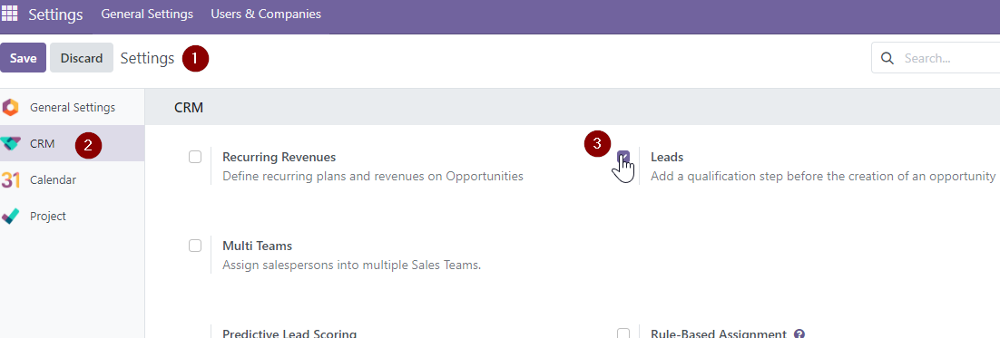
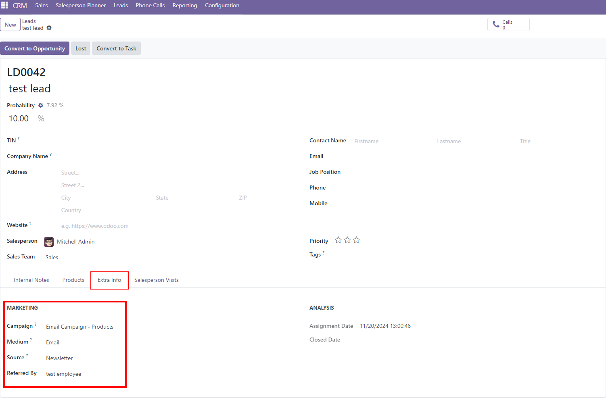
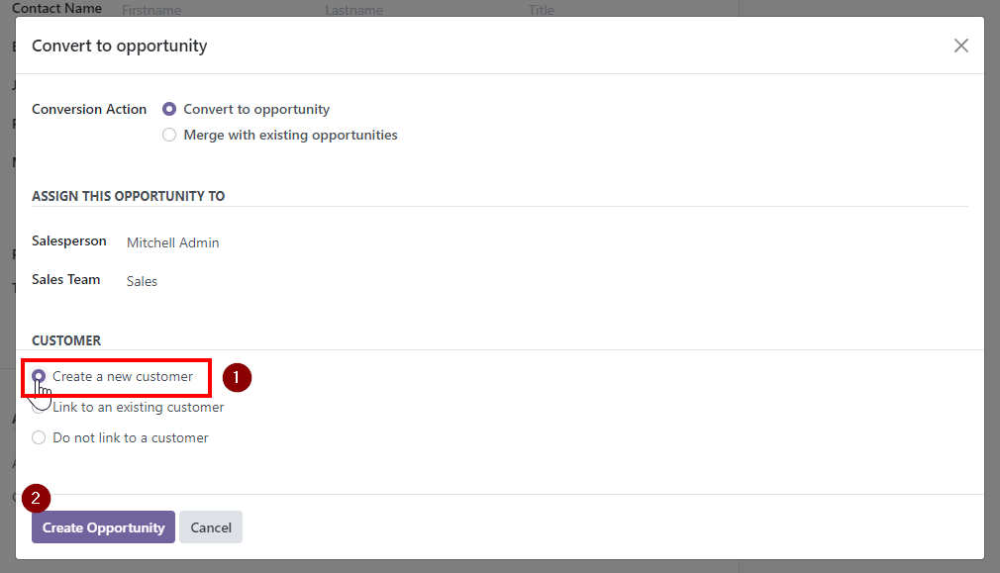
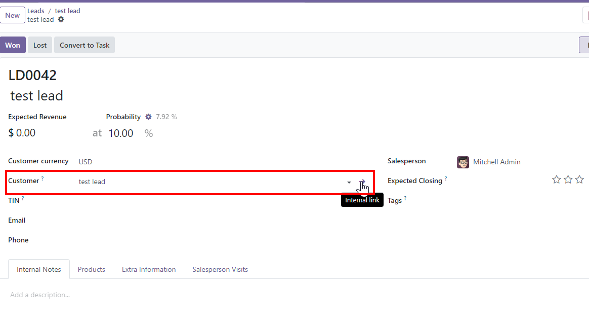
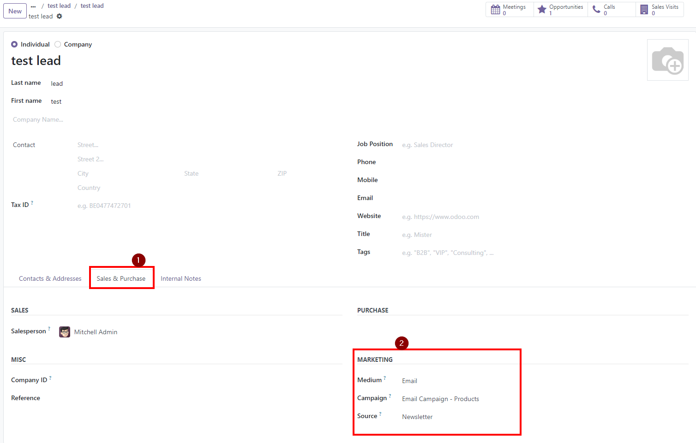

To use this module, here are the steps:

1. If you don't have the "Leads" tab at the top menu in the crm app, go to **Settings \> CRM** and check the box **Leads**.
    
2.  Go to **CRM \> Leads \> Create**.
3.  Fill the required fields.
4.  Go to **Extra Info \> Marketing** and fill those fields:
    
5.  **Save**.
6.  Click **Convert to Opportunity**.
7.  Choose the option **Customer \> Create a new customer**.
8.  Click **Create Opportunity**.
    
9.  Click on the name of the newly linked partner.
    
10.  Go to tab **Sales & Purchases**.
11. There you have the new fulfilled fields in the marketing section.
    
